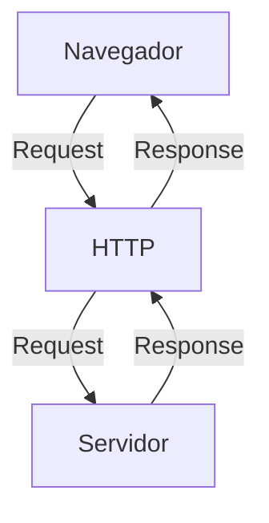
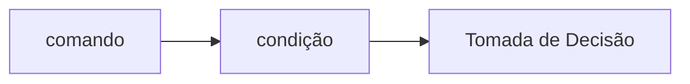
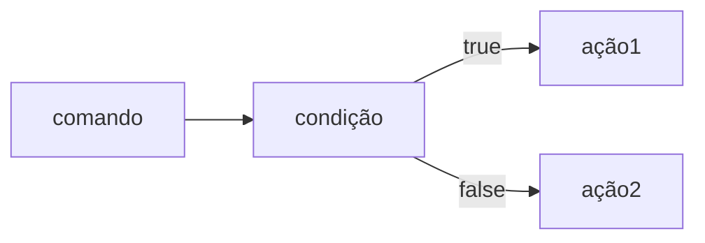
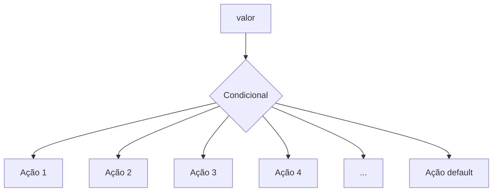
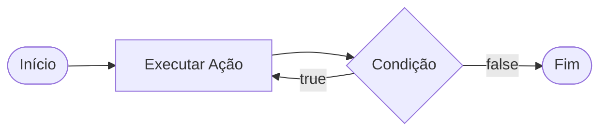

# Curso Backend - 1° semestre - 105h

Prof. Diogo Barbosa

Escola SENAI americana 

2° semestre 2026

## Objetivos do curso

Desenvolver aplicações web Server Side , utilizando a linguagem PHP;
- Aplicar Sintaxe nativa PHP vanilla ;
- Manipulação HTTP;
- Persistêncide dados (Armazenamento em BD);
- Segurança contra SQL Injection/CSRF;
- Refatoração em POO (Programação Orientada Objeto);
- Arquitetura MVC;
- Utilização do framework laravel;

## Cronograma do Semestre 

Carga horária : 105h

Duração: 20 semanas 

### Semana 1: Introdução ao backend e configuração do Ambiente PHP

### O que é backend 

O back-end é a parte de um site ou aplicativo que o usuário não vê, mas que faz tudo funcionar por trás das telas.

- Guarda e organiza informações em um banco de dados;
- Confere se o login e a senha estão corretos;
- Calcula valores, como o frete ou o total de uma compra;
- Garante que os dados de um usuário não apareçam para outro;
- Faz o sistema suportar muitas pessoas usando ao mesmo tempo, sem travar.

As principais linguagens utilizadas no desenvolvimento back-end são PHP, JavaScript/TypeScript, Python, Java, Kotlin, Go (Golang), C# e Rust. 

O backend é o "cérebro" oculto de um site ou aplicativo. Ele roda em um servidor e cuida de tudo o que o usuário não vê na tela.

## As 3 partes básicas de todo backend:

1. **Servidor:** o "computador" que fica ligado esperando pedidos (requisições);
2. **Banco de dados:**  onde as informações ficam guardadas (usuários, produtos, mensagens, etc.);
3. **Lógica de negócio:**  as regras do sistema (ex: "não deixa comprar se não tiver estoque").

## O Mercado de Trabalho em Back-end

O desenvolvimento Back-end é uma das áreas mais cruciais da Tecnologia da Informação. 

-Com a transformação digital acelerada, empresas de todos os portes e setores dependem de infraestruturas sólidas e seguras. 

-Setores de Atuação: Bancos, hospitais, e-commerces, logística, indústrias, startups e órgãos públicos utilizam Back-end para suportar suas operações críticas.

-Fatores de Crescimento: O avanço da computação em nuvem, aplicativos móveis, Big Data e IA impulsiona continuamente a busca por profissionais da área.

-Modelos de Trabalho: Alta flexibilidade com vagas presenciais, híbridas e remotas (inclusive com oportunidades
internacionais).

#### Ciclo de vida da requisição HTTP 

#### O que é HTTP 
**HTTP** , hypertxt transfer protocol, é um protocolo de comunicação utilizado para a transfêrencia de informações na WWW (world wide web) e em outros sistemas de rede 

O HTTP é a base para que o cliente e um servidor web troquem informações . Ele permite a requisição e a resposta de recursos , como imagens, arquivos e as própias páginas web, por meio de mensagens padrão (protocolo).

##### Como funciona o HTTP 

1. O cliente estabelece contato om o servidor , encaminhando uma requisiÇão HTTP ;
2. Nessa requisição o cliente especifica o método pretendido (read-GET, create=POST , update-PUT/PATCH, delete-DELETE)
3. o servidor processa e responde com uma mensagem HTTP, com os recursos solicitados.



### Como funciona na prática o Backend

- **Ação do usuário**: Envia uma solicitação pela UI (interface do usuário). Exemplo de UI: Tela do celular, Navegador da internet, Alexa...
- **Envio do requisição**: A UI transforma ação do usuário em uma requisição HTTP
- **O Processamento BackEnd**: o Código Backend recebe o pedido, valida os dados e decide o que fazer (Ex: consulta uma informação no banco de dados)
- **Resposta**: O servidor devolve o resultado para a UI (Ex. Um login autorizado, Uma compra confirmada)

## Tipos de resquisição HTTP

Os tipos de requisição HTTP indicam a ação que o usuário deseja executar no servidor. As principais ações são:

- **GET**: Pede dados de um lugar específico. "Não faz alterações no servidor"
-**POST**: Envia dados novos para *criar* algo ou processar informações.
-**PUT/PATCH**: Modificar dados ja existentes. *PUT*: Atualizção total dos dados. *PATCH*: Atualização parcial dos dados
-**DELETE**: Apaga um dado no servidor 

---

#### Iniciando o PHP 

##### O que é PHP 

**PHP** (Hypertext PreProcessor) é uma linguagem de programação interpretada e open source, focada no desenvolvimento de sistemas para web, pode ser usada junto com HTML para criação de páginas web dinâmicas.

#### Instalando o PHP 

-- Fazer o Download do PHP (php.net);
- ZIP - Non Thread Safe 8.5
- Descompactar o Arquivo do PHP na pasta C:\src\php (Para Descompactar, usar o 7Zip = Melhor) => nunca salvar arquivo na raiz do sistema(C:)
- Modificar o arquivo php.ini-development para => php.ini ( criar as configurações do PHP na Máquina) - adicionar ou remover funcionalidade do PHP
- Adicionar a Pasta do PHP(C:\src\php) as Variaveis de Ambiente do Sistema (PATH)
- verificar a instalação rodando o Comando php --version

##### Contextualizando o PHP

O PHP de fato é uma das linguagens de programação mais populares da atualidade. Ela permite que você crie aplicações web robustas , de uma maneira muito simplificada e direto ao ponto. Sem contar que a linguagem traz diversos recursos que facilitam e aceleram o processo de desenvolvimento de sites e sistemas para web. E além do mais , ela ainda tem um ótimo ecossistema, uma excelente comunidade e um grande mercado de trabalo.

##### Criando minha primeira aplicação em PHP

Criando um hello, world !!!

##### Criando o perfil de PHPvanilla
-> Profile -> New profile 

-> Extensions:
- PHP IntePhense (A do elefantinho): Autocompletar (Snipets)
- PHP Debug (Xdebug): Acha erros em linha de código
- PHP CS FIXER: Formatação padrão do Código (Identação)
- PHP Server: Sobre um Servidor Local para Acompanhamento em Tempo Real

##### Estudo de Variáveis e Constantes em PHP

Declarar variáveis é alocar um espaço na memoria que permite a inclusão e manipulação de dados.

**Variáveis**

 - devem ser declaradas usando "$" antes do nome da variável
 - podem ser string, Numérica (não precisa declarar o tipo na criação), a tipagem é atribuida ao adicionar o valor 
 - - são não tipadas ( não precisa declara o tipo na criação), a tipagem é atribuida ao adicionar o valor
- Usar o "declare(strict_types=1);" na primeira linha do arquivo ; => blindar o sistema contra conflitos de tipos de variáveis 

**Constantes**
- não podem ser modificas ou redeclaradas após a criação
- pode ser criada usando "const" ou "define"
- não permitem interpolação

### Semana 2 - Operadores em PHP (Aritméticos, Relacionais e Lógicos)
##### Estudo de operadores

**Aritméticos**: São usados para Realizar Cálculos.

| Operador | Nome | Exemplo | Resultado |
| - | - | - | - |
| + | Adição | 10 + 5 | 15 |
| - | Subtração | 10 - 5 | 5 |
| * | Multiplicação | 10 * 5 | 50 |
| / | Divisão | 10 / 5 | 2 |
| % | Módulo (Resto) | 10 % 3 | 1 (10 div 3 da 3, sobra 1) |
| ** | Expoente | 2 ** 3 | 8(2 elevado a 3) |

obs: O Operador % é o melhor amigo de um programador, permite ordenar listas e porganizar fila e pilhas

**Relacionais**:  permitem comparar valores e expressões, retornando um resultado de uma operação relacional sempre booleana: verdadeiro (True) ou falso (False). 

| Nomes | Operador | Exemplo | Resultado |
| - | - | - | - |
| Iguais | = = | "10"= =10 | true | 
| Igualdade Estrita | = = = | "10"= = =10 | false | 
| Diferente | != | "10"! = 10 | false |
| Diferença Estrita | != = | "10"!= =10 | true |
| Maior que | > | 18 > 18 | false |
| Menor que | < | 10 < 20 | true |
| Maior ou Igual | >= | 18 >= 18 | true |
| Menor ou igual | <= | 10 <= 5 | false |

**Lógicos**: Permite a combinação entre sentenças.

- Operador AND (E) => && : para o resultado ser verdadeiro , todas as combinações precisam ser verdadeiras 
     - true && true => true
     - true && false => false

- Operador OR (OU) => || : para o resultado ser verdadeiro , basta APENAS UMA condição ser verdadeira 
     - false || true => true
     -false  || false => false

- Operador NOT (NÃO) => ! : Inverte a lógica da sentença 
     - !true => false
     - !false => true  
     
     ### Semana 3 - Estrutura de Controle de Dados ( Condicionais e Repetição)

- **Conteúdo**: Estruturas `if`, `else`, `elseif`, operadores ternários, `match`=> substituto do `swicth/case` , loops `for`, `while`, `do-while` e `foreach`

#### Estrutura de Controle de Dados ajudam no processo de automatização em programas e sistemas

##### Condicionais (IF, ELSE, ELSEIF)

- **Forma de Uso**:

uso do `if` apenas 
Exemplo:  aplicar um desconto de 10% em comrpas acima de 100 Reais;



```php
if ($valorCompra > 100) {
    $valorCompra = $valorCompra * 0.9;
}
```

- Uso do `if` e do `else`
Exemplo: Aplicar um desconto de 10% para compras acima de 100 reais e 5% para as demais compras



```php

if ($valorCompra > 100) { 
     $valorfinal = $valorcompra*0.1;
} else{ 
     $valorfinal = $valorcompra*0.05;
} 
```

- Uso do `elseif`(encadeado)
Exemplo: compras acima de 200 reais tem 15 % de desconto , acima de 100 reais tem 10% de desconto e outras 5% de desconto 

```mermaid

graph LR
    A[comando] --> B{condição 1}
    B --> |true| C[ação 1]
    B --> |false| D{condição 2}
    D --> |true| E[ação 2]
    D --> |false| F[ação 3] 

  ```

```php 

if($valorCompra > 200) {
    $valorFinal = $valorCompra*0.85;
} elseif($valorCompra >100) {
    $valorFinal - $valorCompra*0.9;
} else {
    $valorFinal = $valorCompra*0.95;
}

```

*obs*: sempre usar `elseif` para situações que precisam de mais de uma condição, ou seja, fazer encadeamento das condições. 

- Uso **ERRADO** do if 

Não fazer o encadeamento de condicionais

```php

if($valorcompra > 200) {
    $valorfinal = $valorcompra *0.85;
}
if($valorcompra > 100) {
    $valorfinal = $valorcompra *0.90;
}
if(valorcompra < 100) {
    $valorfinal = $valorcompra*0.95;
}
```
##### Operadores ternários 
Um atalho para a estrutura condicional `if/else` , normalmente escrito em uma unica linha de código.

` condição ? verdadeira : falso `
Perfeito para decisões curtas de uma linha de comando 
Exemplo: Verificar se pessoa é maior de idade (18)

```php

$idade= 20; 
// O formato é : (condição) ? verdadeiro : falso ; 

$status = ($idade >= 18) ? "Maior de idade" : "menor de idade";

```
##### Expressão `match` (PHP 8)
No mercado de PHP atual , não se usa masi uma dezena de `if/elseif` para checar valores fixos, e o antigo `switch/case`caiu em desuso. Usamos o `match`. Ele compara um valor e retorna diretamente o resultado .

```php 
$diaSemana = date ("Week"); // pega o dia da semana em formato numérico

// transformar dia da semana em formato texto (domingo, segunda,...)

$nomeDiaSemana = match($diasemana){
    "0" => "Domingo",
    "1" => "Segunda",
    "2" => "Terça",
    "3" => "Quarta",
    "4" => "Quinta",
    "5" => "Sexta",
    "6" => "Sábado",
    "default" => "Dia Inválido"
};

```
--- 
##### Laços de repetição 
Um laço de repetição faz com que , um bloco de códigos rode várias vezes, até que uma condição mande parar.

- O laço `while` (enqunato)
Ele verifica se a condição é verdadeira ANTES de entrar no laço ideal quando você não sabe quantas vezes vai rodar o laço.

```mermaid
 flowchart LR 
 A [início] --> B{condição}
 B --true--> C[executa o laço]
 C --> B
 B --false--> D[interrompe o laço]
 ``` 
    
Exemplo: Jogo de Adivinhação de um n° Secreto 
```php

$numeroSecreto = 7;
$tentativas = 0;

while($tentativa != $numeroSecreto){
    echo "tente novamente"
    // vou pegar um n° aleatório entre 1 e 10 
    $tentativa = rand(1,10);
}

echo "Acertouu!! o n° secreto é $numerosecreto"
```
- O laço `do-while` (faça enquanto)
A diferença é que ele executa o bloco pelo menos uma vez, mesmo que a condição seja falsa desde o início, pois ele só pergunta no final .



Exemplo: Jogo de Adivinhação

```php

$numeroSecreto = rand(1,10);

do {
    $tentativa = rand(1,10); //Simular um palpite aleatório

    if($tentativa == $numeroSecreto){
        echo "Parabéns, Acertou!!!";
    }
  
} while ($tentativa != $numeroSecreto);

```

obs: Uso Idela do `do-while`, Menus de sistema ou sistema de solicitações de dados, sistemas interativos;

```